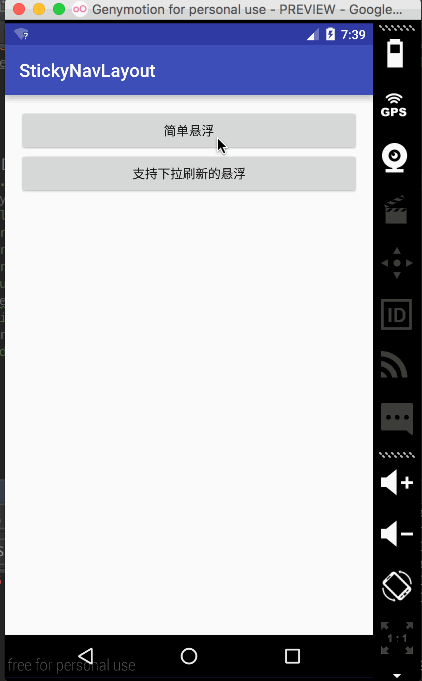

# StickyNavLayout 悬浮控件
该项目是在一个开源项目的基础上修改的</p>
原项目地址:
```java
https://github.com/hongyangAndroid/Android-StickyNavLayout
```
修改如下:</p>
1.在原基础上支持对内容listview等控件空布局的滑动支持</p>
2.修改当刚刚悬浮的时候抬起手触发onItemClick事件的bug</p>
3.修改手快速滑动的时候触发onItemClick事件的bug</p>
4.增加一些自定义属性,后文有介绍</p>
5.增加是否处于悬浮的回调接口,和滑动到悬浮状态的比例:0~1 ;1~0 之间变化的数字</p>
6.增加对GridView-GridViewWithHeaderAndFooterFragment(支持header和footer的支持)</p>
7.修改其它一些bug</p>
8.将原文迁移到AS中</p>
9.将此项目发不到JCenter,方便大家的使用哦</p>

#GridViewWithHeaderAndFooterFragment
```java
地址:https://github.com/liaohuqiu/android-GridViewWithHeaderAndFooter
```
#声明
本项目纯属开源,只是为了更好的提高Android的开发技术,小宝贝们~~~~~

# 效果图

#自定义属性
```java
<resources>
    <declare-styleable name="StickNavLayout">
        <!--默认是否悬停tab-->
        <attr name="isStickNav" format="boolean" />
        <!--距离悬浮的位置-->
        <attr name="stickOffset" format="dimension" />
    </declare-styleable>
</resources>
```

#使用时的注意事项
注意控件id的设置</p>
top区域:id必须为: android:id="@id/id_stickynavlayout_topview"</p>
悬浮区域:id必须为: android:id="@+id/id_stickynavlayout_indicator"</p>
内容区域:id必须为:  android:id="@id/id_stickynavlayout_viewpager"</p>
内容区域</p>
1.比需为ViewPager或者其子类</p>
2.ViewPager的内容可以是Fragment,如果Fragment想用ListView,RecycleView等需要设置其id为:</p>
 android:id="@+id/id_stickynavlayout_innerscrollview"</p>
比如:</p>
```java
<FrameLayout xmlns:android="http://schemas.android.com/apk/res/android"
    xmlns:tools="http://schemas.android.com/tools"
    android:layout_width="match_parent"
    android:layout_height="match_parent"
    tools:context="com.gxz.stickynavlayout.fragments.RecycleViewFragment">

    <android.support.v7.widget.RecyclerView
        android:id="@+id/id_stickynavlayout_innerscrollview"
        android:layout_width="match_parent"
        android:layout_height="match_parent"/>

</FrameLayout>
```
or
```java
<?xml version="1.0" encoding="utf-8"?>
<LinearLayout xmlns:android="http://schemas.android.com/apk/res/android"
    android:layout_width="match_parent"
    android:layout_height="match_parent"
    android:orientation="vertical">


    <ScrollView
        android:id="@+id/id_stickynavlayout_innerscrollview"
        android:layout_width="match_parent"
        android:layout_height="match_parent">

        <TextView
            android:layout_width="match_parent"
            android:layout_height="match_parent"
            android:text="@string/msg"
            android:textSize="20sp" />

    </ScrollView>
</LinearLayout>
```
#使用
```java
    <com.gxz.library.StickyNavLayout
        android:id="@+id/id_stick"
        android:layout_width="match_parent"
        android:layout_height="match_parent"
        stick:isStickNav="true">

        <LinearLayout
            android:id="@id/id_stickynavlayout_topview"
            android:layout_width="match_parent"
            android:layout_height="200dp"
            android:background="#fee"
            android:orientation="vertical">

            <TextView
                android:layout_width="match_parent"
                android:layout_height="match_parent"
                android:gravity="center"
                android:text="top-view"
                android:textAllCaps="true"
                android:textSize="30sp" />
        </LinearLayout>

        <com.gxz.PagerSlidingTabStrip
            android:id="@+id/id_stickynavlayout_indicator"
            android:layout_width="match_parent"
            android:layout_height="48dp"
            android:textSize="16sp"
            pst:pstsDividerColor="@color/colorPrimary"
            pst:pstsIndicatorColor="@color/colorPrimary"
            pst:pstsIndicatorHeight="5dp"
            pst:pstsScaleZoomMax="0"
            pst:pstsShouldExpand="false"
            pst:pstsTextSelectedColor="#303F9F"
            pst:pstsUnderlineColor="@color/colorPrimary" />

        <android.support.v4.view.ViewPager
            android:id="@id/id_stickynavlayout_viewpager"
            android:layout_width="match_parent"
            android:layout_height="match_parent" />

    </com.gxz.library.StickyNavLayout>
```
# Java  代码使用
相信你可以点一下就知道什么用了 .... 是不是呢?小宝贝~~~!!

#接口回调
```java
 stickyNavLayout.setOnStickStateChangeListener(new StickyNavLayout.onStickStateChangeListener() {
            @Override
            public void isStick(boolean isStick) {
                
            }

            @Override
            public void scrollPercent(float percent) {

            }
        });
```
#Maven

```java
<dependency>
        <groupId>com.gxz.pagerslidingtabstrip</groupId>
        <artifactId>library</artifactId>
        <version>1.1</version>
        <type>jar</type>
        <classifier>sources</classifier>
</dependency>
```
# Gradle

```java

    compile('com.gxz.stickynavlayout:library:1.0')
    
```
#Demo 
Demo中的导航控件是:PagerSlidingTabStrip</p>
是我一个开源项目:

```java
  https://github.com/ta893115871/PagerSlidingTabStrip
```    